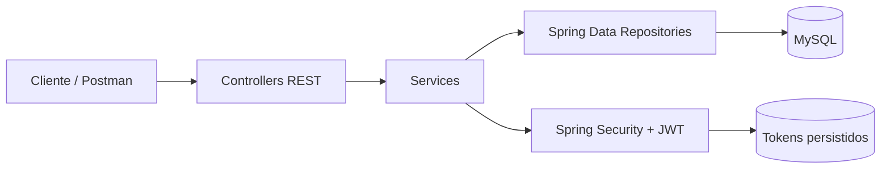
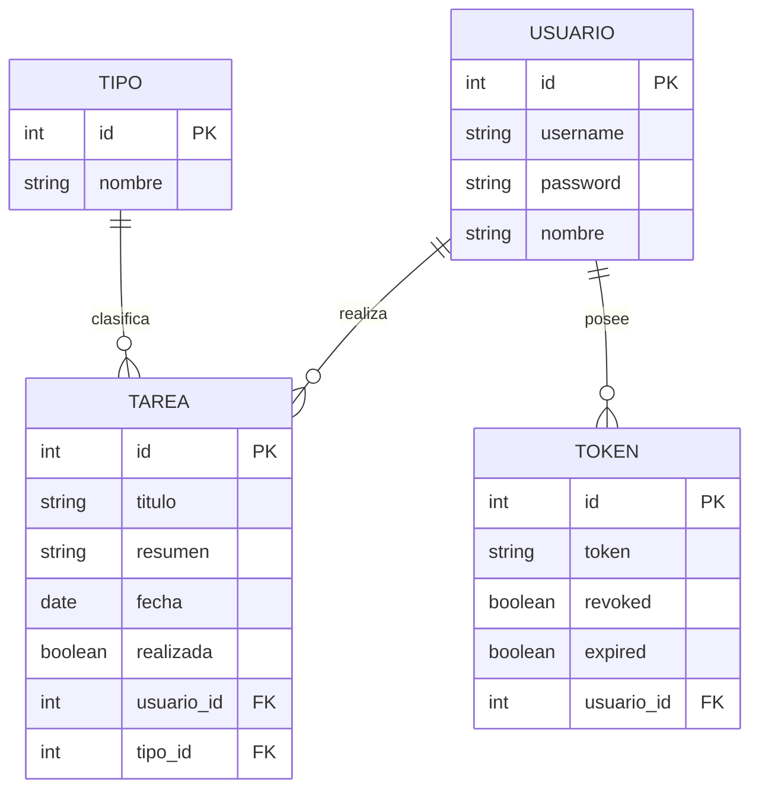

<div align="center">

# AppMicroServicios

### API REST para gestión de tareas con Spring Boot, MySQL y autenticación JWT


Proyecto backend educativo orientado a practicar el diseño de APIs REST, arquitectura por capas,
persistencia relacional, seguridad y despliegue tradicional como archivo WAR.

</div>

---

## 📌 Sobre el proyecto

**AppMicroServicios** implementa el backend de una aplicación de gestión de tareas. La API permite
registrar usuarios, iniciar sesión, renovar tokens, administrar tipos de tarea y consultar o modificar
las tareas asociadas a cada usuario.

El proyecto está organizado siguiendo una arquitectura por capas y utiliza inyección de dependencias
por constructor para mantener separadas las responsabilidades de la aplicación.

> [!IMPORTANT]
> Este repositorio es un **proyecto personal de estudio y portfolio**. Se ha desarrollado siguiendo y
> adaptando los contenidos del curso
> [Desarrollo de microservicios con Spring Boot y Docker](https://www.udemy.com/course/desarrollo-de-microservicios-spring-boot-mysql-docker/),
> impartido por **Miguel Rodríguez** en Udemy. No es un producto oficial del curso ni está afiliado a Udemy.

La implementación se ha trabajado desde **Visual Studio Code**, adaptando el flujo mostrado en el
curso con Spring Tool Suite a un entorno basado en Maven y terminal integrada.

## ✨ Funcionalidades

- Registro de usuarios con contraseña cifrada mediante **BCrypt**.
- Inicio de sesión mediante `username` y `password`.
- Generación de **access token** y **refresh token** firmados con JWT.
- Renovación del access token a partir de un refresh token válido.
- Persistencia y revocación de tokens de acceso.
- Consulta, actualización y eliminación de usuarios.
- Creación, consulta y eliminación de tipos de tarea.
- Creación y eliminación de tareas asociadas a un usuario y a un tipo.
- Filtrado de tareas por fecha y estado de realización.
- Consulta agregada mediante una query SQL nativa y respuesta DTO.
- Persistencia automática del modelo mediante JPA/Hibernate.
- Empaquetado como **WAR ejecutable y desplegable en Apache Tomcat**.

## 🧠 Qué demuestra este repositorio

- Diseño de endpoints REST con Spring MVC.
- Separación de responsabilidades mediante controladores, servicios y repositorios.
- Modelado de relaciones `ManyToOne` con Jakarta Persistence.
- Uso de consultas derivadas de Spring Data y SQL nativo.
- Configuración de Spring Security y autenticación basada en credenciales.
- Cifrado de contraseñas y ciclo de vida de tokens JWT.
- Gestión de dependencias y ciclos de construcción con Maven.
- Conexión de una aplicación Java con MySQL.
- Pruebas de arranque del contexto de Spring Boot.
- Preparación de una aplicación para despliegue tradicional en un contenedor servlet.

## 🏗️ Arquitectura



El flujo principal sigue la estructura:

```text
HTTP Request
    └── Controller
        └── Service
            └── Repository
                └── MySQL
```

### Modelo de datos



## 🛠️ Tecnologías y herramientas

| Área | Tecnología | Uso en el proyecto |
|---|---|---|
| Lenguaje | Java 25 | Implementación del backend |
| Framework | Spring Boot 4.1.0 | Configuración y arranque de la aplicación |
| API web | Spring MVC | Controladores y endpoints REST |
| Seguridad | Spring Security | Autenticación y autorización de rutas |
| Tokens | JJWT 0.13.0 | Generación, firma y validación de JWT |
| Contraseñas | BCrypt | Hash seguro de credenciales |
| Persistencia | Spring Data JPA / Hibernate | Acceso a datos y mapeo objeto-relacional |
| Base de datos | MySQL | Persistencia relacional |
| Build | Apache Maven | Dependencias, pruebas y empaquetado |
| Servidor | Apache Tomcat | Ejecución embebida y despliegue WAR |
| Testing | JUnit 5 / Spring Boot Test | Prueba de carga del contexto |
| Desarrollo | Visual Studio Code | Edición, ejecución y depuración |
| Pruebas manuales | Postman | Consumo y validación de endpoints |
| Control de versiones | Git | Historial y gestión del código |

> Docker forma parte del itinerario del curso y está contemplado en el roadmap, pero este repositorio
> todavía no incluye un `Dockerfile` ni un archivo `compose.yaml`.

## 🔌 Endpoints

La URL base durante el desarrollo es:

```text
http://localhost:8080
```

### Autenticación

| Método | Endpoint | Descripción | Acceso |
|---|---|---|---|
| `POST` | `/auth/registro` | Registra un usuario y devuelve tokens | Público |
| `POST` | `/auth/login` | Autentica credenciales y devuelve tokens | Público |
| `POST` | `/auth/refresh` | Genera un nuevo access token | Público* |

`/auth/refresh` espera el refresh token en la cabecera `Authorization` usando el formato
`Bearer <refresh-token>`.

### Usuarios

| Método | Endpoint | Descripción |
|---|---|---|
| `GET` | `/usuarios` | Obtiene todos los usuarios |
| `GET` | `/usuarios/{username}` | Obtiene un usuario por su username |
| `PUT` | `/usuarios` | Actualiza los datos de un usuario |
| `DELETE` | `/usuarios/{username}` | Elimina un usuario y sus tareas asociadas |

### Tipos de tarea

| Método | Endpoint | Descripción |
|---|---|---|
| `GET` | `/tipos` | Obtiene todos los tipos |
| `POST` | `/tipos` | Crea un tipo de tarea |
| `DELETE` | `/tipos/{id}` | Elimina un tipo y sus tareas asociadas |

### Tareas

| Método | Endpoint | Descripción |
|---|---|---|
| `GET` | `/tareas/{username}` | Obtiene las tareas de un usuario |
| `POST` | `/tareas/{username}/{tipo}` | Crea una tarea para un usuario y tipo |
| `DELETE` | `/tareas/{id}` | Elimina una tarea por su identificador |
| `GET` | `/tareas/{username}/por-fecha?fecha=YYYY-MM-DD` | Filtra las tareas por fecha |
| `GET` | `/tareas/{username}/por-realizadas?realizada=true` | Filtra por estado de realización |
| `GET` | `/tareas/info` | Devuelve información agregada de tareas |

> [!NOTE]
> La configuración de seguridad marca `/auth/**` como público y el resto de rutas como protegidas.
> La generación y renovación JWT ya están implementadas; la incorporación del filtro Bearer que
> autentique cada petición protegida figura como siguiente mejora del roadmap.

## 🧪 Ejemplos de uso

### Registrar un usuario

```http
POST /auth/registro HTTP/1.1
Host: localhost:8080
Content-Type: application/json

{
  "username": "ada",
  "password": "change-me",
  "nombre": "Ada Lovelace"
}
```

Respuesta esperada:

```json
{
  "accessToken": "<jwt-access-token>",
  "refreshToken": "<jwt-refresh-token>"
}
```

### Iniciar sesión

```http
POST /auth/login HTTP/1.1
Host: localhost:8080
Content-Type: application/json

{
  "username": "ada",
  "password": "change-me"
}
```

### Renovar el token de acceso

```http
POST /auth/refresh HTTP/1.1
Host: localhost:8080
Authorization: Bearer <jwt-refresh-token>
```

### Crear un tipo de tarea

```http
POST /tipos HTTP/1.1
Host: localhost:8080
Content-Type: application/json

{
  "nombre": "Backend"
}
```

### Crear una tarea

```http
POST /tareas/ada/Backend HTTP/1.1
Host: localhost:8080
Content-Type: application/json

{
  "titulo": "Documentar la API",
  "resumen": "Preparar documentación técnica para el repositorio",
  "fecha": "2026-08-27"
}
```

## 🚀 Puesta en marcha

### Requisitos previos

- JDK 25.
- Apache Maven 3.9 o superior.
- MySQL 8 en ejecución.
- Una base de datos llamada `appmicrosdb`.
- Git y, opcionalmente, Postman.

### 1. Clonar el repositorio

```bash
git clone https://github.com/IsidoroGM/Tareas-con-Microservicios.git
cd Tareas-con-Microservicios
```

### 2. Crear la base de datos

```sql
CREATE DATABASE appmicrosdb
    CHARACTER SET utf8mb4
    COLLATE utf8mb4_unicode_ci;
```

### 3. Configurar la aplicación

Revisa `src/main/resources/application.properties` y adapta estos valores a tu entorno local:

```properties
spring.datasource.url=jdbc:mysql://127.0.0.1:3306/appmicrosdb
spring.datasource.username=<mysql-user>
spring.datasource.password=<mysql-password>

application.security.jwt.secret-key=<base64-secret-key>
application.security.jwt.expiration=<access-token-expiration-ms>
application.security.jwt.refresh-expiration=<refresh-token-expiration-ms>
```

La opción `spring.jpa.hibernate.ddl-auto=update` permite que Hibernate actualice el esquema durante
el desarrollo.

### 4. Ejecutar la aplicación

```bash
mvn clean spring-boot:run
```

La API quedará disponible en `http://localhost:8080`.

## ✅ Pruebas

```bash
mvn clean test
```

Actualmente se incluye una prueba de humo que verifica que el contexto de Spring Boot puede arrancar
correctamente y conectarse con la configuración disponible.

## 📦 Empaquetado WAR

El proyecto extiende `SpringBootServletInitializer`, utiliza packaging `war` y declara Tomcat con
alcance `provided` para permitir el despliegue en un contenedor externo.

```bash
mvn clean package
```

El artefacto se genera en:

```text
target/AppMicroServicios-0.0.1-SNAPSHOT.war
```

También puede ejecutarse directamente:

```bash
java -jar target/AppMicroServicios-0.0.1-SNAPSHOT.war
```

> El entorno de despliegue debe utilizar una versión de Java compatible con la versión empleada
> durante la compilación.

## 📂 Estructura del proyecto

```text
src/
├── main/
│   ├── java/MicroS/app/
│   │   ├── Config/          # Spring Security y beans de autenticación
│   │   ├── Controllers/     # Entrada HTTP de la API
│   │   ├── DTO/             # Objetos de entrada y salida
│   │   ├── Persistence/
│   │   │   ├── Entities/    # Entidades JPA
│   │   │   └── Repositories/# Acceso a MySQL con Spring Data
│   │   └── Services/        # Lógica de negocio, JWT y autenticación
│   └── resources/
│       └── application.properties
└── test/                    # Pruebas automatizadas
```

## 🗺️ Roadmap

- [x] API REST con arquitectura por capas.
- [x] Persistencia MySQL con Spring Data JPA.
- [x] Registro y login con BCrypt.
- [x] Generación de access token y refresh token.
- [x] Renovación y revocación de tokens.
- [x] Gestión de usuarios, tipos y tareas.
- [x] Consultas derivadas y query SQL nativa.
- [x] Empaquetado WAR para Apache Tomcat.
- [ ] Incorporar un filtro JWT por petición y seguridad stateless completa.
- [ ] Añadir validación de DTOs y manejo global de excepciones.
- [ ] Evitar la exposición de entidades JPA en las respuestas mediante DTOs específicos.
- [ ] Externalizar credenciales y secretos mediante variables de entorno y perfiles.
- [ ] Documentar la API con OpenAPI/Swagger.
- [ ] Ampliar pruebas unitarias, de integración y de seguridad.
- [ ] Añadir Dockerfile y Docker Compose para aplicación y MySQL.
- [ ] Incorporar integración continua con GitHub Actions.

## 🔐 Alcance y seguridad

Este proyecto tiene fines formativos y continúa en evolución. Antes de utilizarlo en producción sería
necesario completar el filtro de autenticación JWT, externalizar todos los secretos, validar las
entradas, normalizar las respuestas de error y ampliar la cobertura de pruebas.

---

<div align="center">

Desarrollado con ☕, curiosidad y ganas de aprender backend con Spring Boot.

Si este proyecto te resulta interesante, puedes dejar una ⭐ y compartir feedback.

</div>
